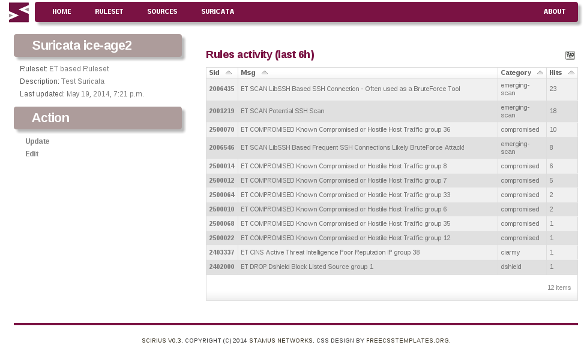
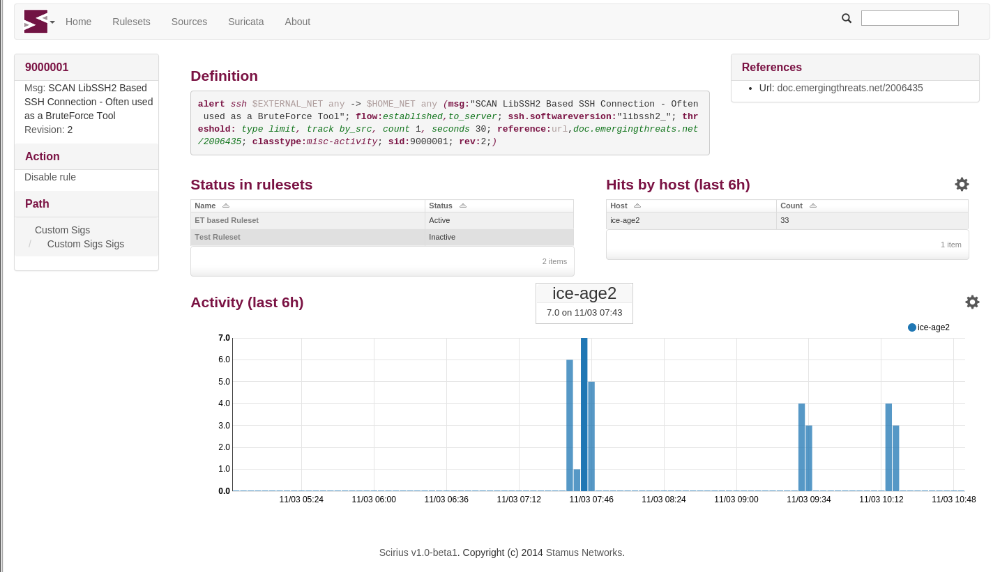
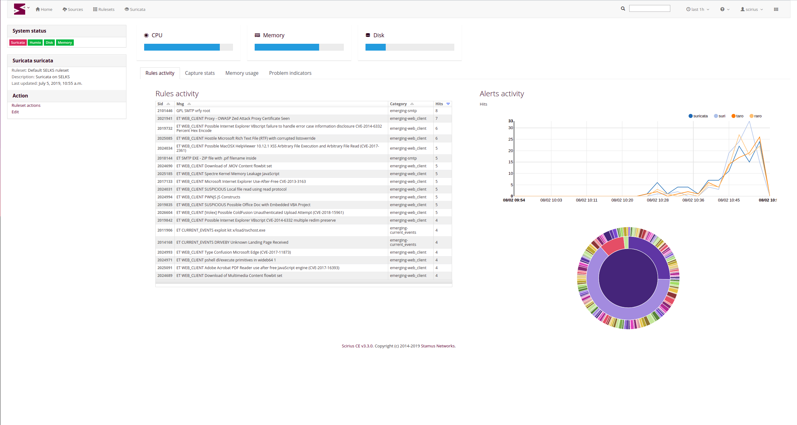
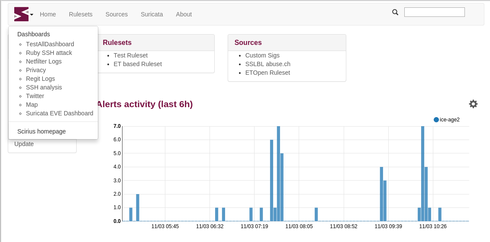

Installation and setup
======================

Installing Scirius CE
---------------------

Scirius CE is an application written in `Django <https://www.djangoproject.com/>`_. It requires
at least Django 1.11 and has not yet support for Django 2.0.

Scirius CE also uses `webpack <https://webpack.js.org/>`_ to build CSS and JS bundles.

Dependencies
~~~~~~~~~~~~

The easy way to install the dependencies is to use `pip <https://pypi.python.org/pypi/pip>`_:

On Debian, you can run ::

 aptitude install python-pip python-dev

You can then install django and the dependencies ::

 pip install -r requirements.txt

To use the suri_reloader script which is handling suricata restart, you will also need
pyinotify ::

 pip install pyinotify

It has been reported that on some Debian system forcing a recent GitPython is required ::

 pip install gitpython==0.3.1-beta2

You will also potentially needs the gitdb module ::

 pip install gitdb

For npm and webpack, you need a stable version of npm and webpack version 3.11. On Debian
you can do ::

 sudo apt-get install npm
 sudo npm install -g npm@latest webpack@3.11
 npm install
 cd hunt
 npm install
 npm run build

Running Scirius CE
~~~~~~~~~~~~~~~~~~

From inside the source directory, you can initiate Django database ::

 python manage.py migrate

Authentication is by default in scirius so you will need to create a superuser
account ::

 python manage.py createsuperuser

Before starting the application you need to construct the bundles by running webpack and collect static files::

 webpack
 python manage.py collectstatic

This step as to be done after each code update.

One of the easiest way to try Scirius CE is to run the Django test server ::

 python manage.py runserver

You can then connect to ``localhost:8000``.

If you need the application to listen to a reachable address, you can run
something like ::

 python manage.py runserver 192.168.1.1:8000

Suricata setup
--------------

Scirius CE is generating one single rules files with all activated rules. When editing
the Suricata object, you have to setup the directory where you want this file to be generated
and the associated files of the ruleset to be copied.

Scirius CE won't touch your Suricata configuration file aka ``suricata.yaml``. So you have
to update it to point to the directory where data are setup by Scirius CE. If you are
only using rules generated by Scirius CE, you should have something looking like in
your ``suricata.yaml`` file ::

 default-rule-path: /path/to/rules
 rule-files:
  - scirius.rules

To use the `Use IP reputation instead of group` feature you also need to have ::

 reputation-categories-file: /path/to/rules/scirius-categories.txt
 default-reputation-path: /path/to/rules
 reputation-files:
  - scirius-iprep.list

To interact with Scirius CE, you need to detect when ``/path/to/rules/scirius.reload`` file
are created, initiate a reload or restart of Suricata when it is the case and delete the
reload file once this is done.

One possible way to do that is to use ``suri_reloader`` available in ``suricata/scripts``
directory. The syntax of ``suri_reloader`` can be something similar to ::

 suri_reloader -p /path/to/rules  -l /var/log/suri-reload.log  -D

Use ``-h`` option to get the complete list of options. Please note that ``suri_reloaded``
uses the ``service`` command to restart or reload Suricata. This means you need a init
script to get it working.

Link with Elasticsearch
-----------------------

If you are using Suricata with Eve logging and Elasticsearch, you can get information
about signatures displayed in the page showing information about Suricata:

You can also get graph and details about a specific rule:

To setup Elasticsearch connection, you can edit ``settings.py`` or create a
``local_settings.py`` file under ``scirius`` directory to setup the feature.
Elasticsearch is activated if a variable names ``USE_ELASTICSEARCH`` is set
to True in ``settings.py``. The address of the Elasticsearch is stored in the
``ELASTICSEARCH_ADDRESS`` variable and uses the format ``IP:port``.

For example, if your Elasticsearch is running locally, you can add
to ``local_settings.py`` ::

 USE_ELASTICSEARCH = True
 ELASTICSEARCH_ADDRESS = "127.0.0.1:9200"

Please note, that the name of the Suricata (set during edition of the object) must
be equal to the ``host`` key present in Elasticsearch events. It can also be edited here: scirius -> suricata -> edit.

On logstash side, the only necessary thing is to make sure that the @timestamp is equal
to the timestamp value provided in Suricata events. To do so and if you Suricata events
are of type `SELKS` on can use ::

 filter {
   if [type] == "SELKS" {
     date {
       match => [ "timestamp", "ISO8601" ]
     }
   }
 }

This is necessary to avoid glitch in the graphics generated by Scirius CE.

Link with Humio
---------------

If you are using Suricata with eve logging and Humio, you can get information
about signatures on the home page, the Suricata page and for individual rules:

To link Scirius with Humio you must edit the settings, either in ``scirius/settings.py``
or in a local ``local_settings.py`` in the project root directory ::

 USE_ELASTICSEARCH = True
 USE_SURICATA_STATS = True
 ES_BACKEND = 'HUMIO'

and input the information of your Humio instance ::

 HUMIO_API_TOKEN = '<api token for your Humio instance>'
 HUMIO_HOST = '<the url of your Humio instance, e.g. "https://example.com" >'
 HUMIO_REPOSITORY = '<the Humio repository for your Suricata eve events>'

Note that only known Suricata probes will be displayed. A probe can be added to Scirius with ::

 python manage.py addsuricata <probe name> <description> <output directory> <ruleset name>

Link with Kibana
----------------

If you are using Kibana, it is possible to get links to your dashboards by clicking the
top left icon:

To activate the feature, you need to edit your `local_settings.py` file: ::

 KIBANA_URL = "http://localhost/"
 USE_KIBANA = True

